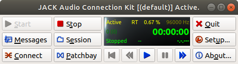
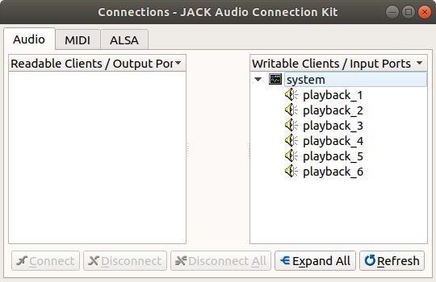
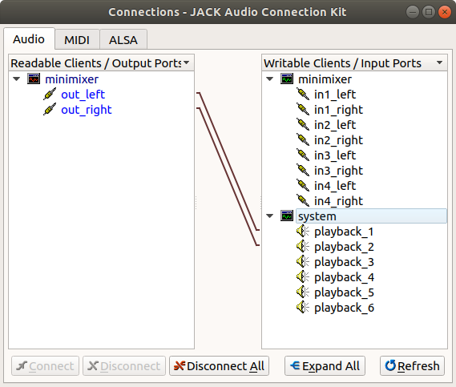

## Basic Plan: JACK audio with a mixer controlled by OSC commands

This has been tested on an updated Ubuntu 18.04 installation on the desktop and on a Ubuntu 19.04 server installation on the Raspberry Pi (i.e., ubuntu-19.04-preinstalled-server-armhf+raspi3.img.xz from here:[http://cdimage.ubuntu.com/releases/19.04/release/]).

### Testing

***Remember:*** If stuff is weird on the laptop it may be because anaconda has
stolen our path!!!

#### Install jack
Install the jack daemon and tools. In order to get realtime priority, you'll also need
to be a member of the audio group. (*You'll likely need to reboot for the group addition
to take effect.*)

```
sudo apt install libjack-jackd2-dev jack-tools
sudo usermod -a -G audio <your-username>
```


### (optional) Install ubuntu studio control
ubuntustudio-controls ubuntustudio-performance-tweaks

#### jackminimix
[https://github.com/njh/jackminimix/]

```
# Install required packages
sudo apt install liblo-tools liblo-dev autotools-dev autoconf automake

# Install jackminimix
git clone https://github.com/njh/jackminimix.git
cd jackminimix
./autogen.sh
./configure
make
make install
```

Note that there's a 'GAIN_FADE_RATE` value which is defined as 400 db/minute.
This gives nice transitions, but extends sounds a bit.

#### jackmeter
Useful to see stuff working

#### sndfile-jackplay
[https://github.com/erikd/sndfile-tools/]

```
# Install required packages
sudo apt install libtool libsndfile1-dev libsamplerate0-dev libfftw3-dev libcairo2-dev

# Install sndfile-tools
git clone https://github.com/erikd/sndfile-tools.git
cd sndfile-tools
./autogen.sh
./configure
make
sudo make install
```


#### GPIO

To install the newest and greatest RPi.GPIO, we have to `pip` from the source
repository. Since it's hosted in SVN, we need to `apt install mercurial`. Then,
we can `pip3 install hg+http://hg.code.sf.net/p/raspberry-gpio-python/code#egg=RPi.GPIO`
This solves issues with `/proc/cpuinfo`, but still raises a `Cannot access
/dev/mem` error unless run with root, and even then you need a fancy thing in
the `cmdline.txt` file. See [README.md].


#### How do we test

  - Use `mplayer -ao jack Linchirp.ogg -loop 0` to loop audio files (plays wav also).
  - Start up JackMiniMixer. Start as `./jackminimix -v` (verbose option is useful for feedback.)
  - Use qjackctl to make sure that everything gets connected (i.e., different audio sources to
    different mixer channels) graphically. There probably is a command line way too?
  - Send OSC commands to control stuff. E.g., `oscsend "osc.udp://localhost:14161" "/mixer/channel/set_gain" if 2 -10.0`
  - *NOTE* If you don't hear anything or it's too loud, check alsamixer for volume with JACK
    running


  - We've added a gapless looping wave file player from the sndfile-tools
    library. For some reason the packaged version doesn't connect to the jack
    daemon, but we've copied the source into the PlaySound directory. Compile
    with ' '
  - To play, use `./PlaySound/jplay -l0 -a=minimixer:in1_right 15khz_sine.wav`.
    Note that the `-l 0` flag loops infinitely (gapless FTW!) and the `-a` flag
    specifies to send data to the minimixer. Can just skip that to test.
    Other stuff is here -
    [http://mega-nerd.com/libsndfile/tools/](http://mega-nerd.com/libsndfile/tools/).

  - `jack_lsp --connections` is a useful command for seeing what the connections are.

  - The $1M question is what is the latency from detecting an event (i.e., a
    nose poke) to modulating the sound. To test this, we need to run the JACK
    daemon, the minixer, and a Python script which sends osc commands based on
    IO.
       1. Start JACK: `jackd -R -P10 -v -d alsa -p64 -n2 -P hw:1,0` (`-R` is
          realtime, `-P` priority is 10, -v verbose, `-d` set alsa output device,
          `-p 64` set the buffer to be small and `-n 2` have a minimal number of
          buffers, and `-P hw:1,0` set the proper soundcard) We could also add
          a `-r 192000` to set the sampling rate. Check for the proper soundcard by listing audio devices with `aplay -l`, and looking for the numbers associated with the desired sound card and device on it. (`hw:<#>,<#>` stands for *hardware: card_number, device_number*.) See [here](https://www.mankier.com/1/jackd) for a nice list of available command-line parameters (including backends).

       2. Start the minimixer: `jackminimix -a -p 12345` (optionally `-v` to
	  see commands coming through.) Note that `12345` is the port for osc
          control. You can change it to something else, but make sure your other
          code matches. If you need to swap the input/output connections, run `jackminimix -l <input_ID> -r <input_ID> -p 12345`, where `<input_ID>` is the input to the left and right outputs of the mixer, respectively. (e.g. `system:playback_1`).

       3. Start an audio loop playing into the mixer: `./PlaySound/jplay -l0
          -a=minimixer:in1_right 15khz_sine.wav`

       4. Figure out what the minimix port is, and then set it and run the test
          script `sudo python3 TestPiAudioControl.py`. It has to be run as root
          because RPi.GPIO appears to require it. This script toggles pin 17
          every 200 ms, while continuously reading from the UART data stream. If
          it detects a changed value on pin 16, it sends an OSC message to
          either make the gain 0.0 dB (full volume) or -30.0 dB. Putting the
          oscilloscope on pin 16 and the speaker, we see sound changes starting
          about 6-7 ms following the edge of the pin. This is consistent with
          first a worst-case UART sampling delay of 2 ms  followed by a few
          sound buffers worth of latency. (Note that with `-p64`, each buffer is
          *1.3 ms* long, so with `n2`, that means a minimum of 2.6 ms of
          latency. I guess the minimixer 

#### Running audio in background
Optional arguments can vary. See above for details.

```
# Start jack daemon
jackd --realtime -P 10 -d alsa -p 128 -n 2 -r 96000 -P hw:0,0

# Start jackminimix on port 12345
jackminimix -a -p 12345

# Play sounds in different channels continuously
sndfile-jackplay -l0 -a=minimixer:in1_right pink_noise.wav
sndfile-jackplay -l0 -a=minimixer:in2_right tone_cloud.wav
sndfile-jackplay -l0 -a=minimixer:in3_right tone.wav
```

#### Some notes on JACK
JACK creates virtual connections between audio sources and targets, typically for one device (e.g. sound card). We can specify which device JACK manages by adding the `-d` or `-P` flag *after* the `alsa` flag:

```
jackd --realtime -P 10 -d alsa -p 128 -n 2 -r 96000 -d hw:0,0
```

See notes above for determining the device name (one could also use the shorthand name found from the commmand `cat /proc/asound/cards` in the format `hw:<name>`; see [here](https://jackaudio.org/faq/device_naming.html) or [here](https://superuser.com/a/53977) for more details.). Once the device is found, JACK will then automatically create the appropriate virtual input and output ports that correspond to those on the device. For example, when specifying a Xonar DG sound card in the command above, JACK creates six output ports, one for each native output port in the sound card: front left, front right, side surround, center surround/subwoofer, S/PDIF digital output, and front panel. We can view this by opening the GUI QjackCtl (by simplying running `qjackctl` from the command line):



and clicking the "Connect" button on the bottom left.



As we can see, JACK has already recognized the six output ports on our Xonar DG sound card, and named them accordingly: `system:playback_x`, which is the default name for raw MIDI ports on the ALSA driver (as implemented [here](https://github.com/jackaudio/jack2/blob/master/linux/alsarawmidi/JackALSARawMidiPort.cpp#L48); likewise, input ports are assigned the names `system:capture_x` by default). Next, we fire up the minimixer from the command line, using the `-a` flag for auto-connection and allowing the default of four input channels (which can be specified with the `-c` flag): 

```
jackminimix -a -p 12345
```

and view the updated connections on QjackCtl:



Because the JACK minimix is "JACK aware", it detected the running JACK server and automatically connected its output ports to the first two playback ports on the server. These correspond to "front left" and "front right" on our sound card. Note the minimix can set up any number of input channels (within limits), each of which contain a left and right side, but only one output channel with left and right sides; the actual output is determined by the sum of the inputs plus the MIDI commands for each input channel that determine its gain. We could achieve the same goal by specifying to which JACK playback ports the left and right minimix outputs connect:

```
jackminimix -l system:playback_1 -r system:playback_2 -p 12345
```

Finally, let's discuss how we route the sound to multiple outputs. We have two options:
1. Create a stereo audio file with the desired number of outputs. Play the sound using `sndfile-jackplay` without specifying any ports (i.e. do not use the `-a` flag). This will route the stereo file appropriately so that the channels in the stereo file will align with the corresponding outputs. Make sure that the ALSA driver has Analog Output set to Stereo mode by using the `alsamixer` command.
2. Feed mono audio files into the left or right channels of the minimixer using the flag `-a=minimixer:in<channel>_<side>`, where `channel` is the channel number and `side` is left or right. (If you get confused, simply refer to the writeable ports listed in QjackCtl.) The volume of each channel (but not left or right side individually) can be controlled by sending `osc` commands to the minimixer as detailed above. Unlike the first method, this method is limited the just two outputs (left and right). Make sure that the ALSA driver has Analog Output set to Multichannel mode. Also, check that the speaker balance is set appropriately so that one side isn't muted!

### OSC commands

#### Python

  - Wrote a Python script to make a pure tone sinewave at arbitrary sampling
    rates - `GenerateTone.py`. Note that the gain was weird when we tried to
    write it as a mono file instead of stereo.

  - Python script that sends OSC commands uses `oscpy` library. `pip3 install
    oscpy` gets it.

#### Command line

example `oscsend "osc.udp://localhost:12345" "/mixer/channel/set_gain" if 2 -10.0`
