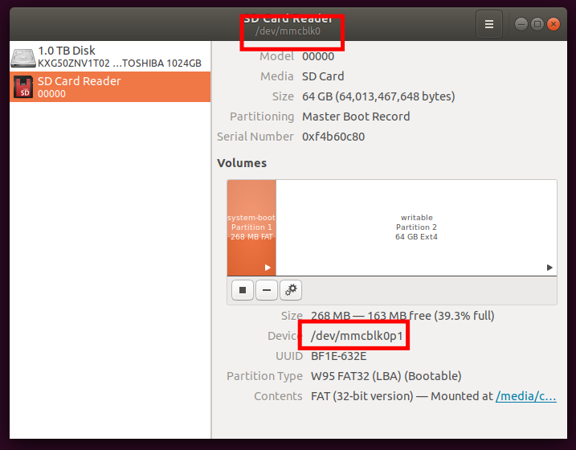

# Getting a Raspberry Pi up and running

These are installation instructions for use with the Ubuntu Server 19.04 pre-installed arm64 
images. They might work for other Ubuntu versions. They assume that you are running some sort
of Ubuntu variant on the desktop.

### 1. Getting the image
Download an official Ubuntu Server preinstalled image for the Raspberry Pi. For 19.04, this can
be found here: http://cdimage.ubuntu.com/releases/19.04/release/ The one you want is called 
`ubuntu-19.04-preinstalled-server-arm64+raspi3.img.xz`. This is the 64-bit version (Raspbian is
stuck at 32-bit at the moment), and designed for the Pi v3.

### 2. Writing it to disk
Put your SD card into your computer and figure out what device it is. In my case, when I run
GNOME Disks (which comes installed by default in 18.04), and I click on the SD Card, I see in
the title bar of the window `/dev/mmcblk0`. Further down in the window, I see `/dev/mmcblk0p1`,
but this is referring to the first partition, which is currently selected.



To write the image you've downloaded to the SD card, use the command: 
`xzcat ubuntu-19.04-preinstalled-server-arm64+raspi3.img.xz | sudo dd of=/dev/mmcblk0 bs=32M`.
What this does is uncompress the image and copy it bitwise to the device. This will end up
with a MBR and two partitions on the device.

### 3. Before you boot
Ubuntu Server now ships with cloud-init. If you follow their instructions for installation, it
will require you to have a working Ethernet connection upon first boot, and you'll end up with
a default user named `ubuntu`. I prefer to customize things a bit. Create two files,
`cloud.cfg` and `60-wifi.yaml`. Make the necessary changes in these files (edit the password
hash in `cloud.cfg` and the wifi password in `60-wifi.yaml`. These will set up a new user with
a pre-set password and the eduroam wifi. The text of the files are below. You should mount the
'writable' partitioni (not the boot one) of your just copied SD card, and copy these files into
place. In my setup, these get mounted at `/media/ckemere/writeable`. 

```
sudo cp cloud.cfg /media/YOURUSERNAME/writeable/etc/cloud/cloud.cfg
sudo cp 60-wifi.yaml /media/YOURUSERNAME/writeable/etc/netplan/60-wifi.yaml
```

### 4. Booting the Pi
Now, unmount the SD card (`umount /media/YOURUSERNAME/writeable` and `unmount
/media/YOURUSERNAME/system-boot` if you mounted the other partition) and remove it. Put it into
the Raspberry Pi, hook up an HDMI monitor, a keyboard, and a mouse, and plug in the
power. You'll see a bunch of stuff happening. The first boot takes a while, and the final
stages should complete with the generation of some SSH certificates. It took maybe 3-4
minutes for me.

After you get a login prompt, log in with the kemerelab account and the password you set up.
When you run `ifconfig` if the wireless worked ok, you should see an IP address assigned. Try
ssh'ing from another computer. You may need to reboot once before everything works.


### 5. Post first boot
Now you should be able to do other stuff. If you decide you want Ethernet, you can also copy
the Ethernet yaml file at the bottom of this page into the `/etc/netplan/`. Or perhaps you want
instead to read up on using static IP addresses and have a different netplan file.

If you successfully set up wireless, you should be able to access the internet and the package
repositories and install away. 

**Note:** Before I figured out all this, I was stuck trying to use Ethernet without a
connection outside of Rice. There are ways to tunnel apt through SSH. You can figure it out if
you Google/Bing enough...


#### `cloud.cfg`
This is almost the same as the default configuration, with just a couple of changes. Note that
the password hash is generated by `python3 -c 'import crypt,getpass;
print(crypt.crypt(getpass.getpass(), crypt.mksalt(crypt.METHOD_SHA512)))`. I usually use the
lab default password, but put in a different one since this will be on github. You should
regenerate it for lab use with the default password!

```
# The top level settings are used as module
# and system configuration.

# A set of users which may be applied and/or used by various modules
# when a 'default' entry is found it will reference the 'default_user'
# from the distro configuration specified below
users:
   - default
################################################################################
   ##### Added for the kemerelab
   - name: kemerelab
     gecos: Kemerelab Default
     primary_group: kemerelab
     passwd: $6$ae.7mwNlox6iVCu/$5O8ZD3LzO.VYxOGjxuJLpSYEtfguVcVeqiGnLA0KMAenItT4.12d7.kdWxIu0zjq2PU8Dq3n2u8jfNItvjRxH/
     lock_passwd: false
     groups: [adm, audio, cdrom, dialout, dip, floppy, lxd, netdev, plugdev, sudo, video]
     sudo: ["ALL=(ALL) NOPASSWD:ALL"]
     shell: /bin/bash
################################################################################

# If this is set, 'root' will not be able to ssh in and they
# will get a message to login instead as the default $user
disable_root: true

# This will cause the set+update hostname module to not operate (if true)
preserve_hostname: false

################################################################################
##### Added for the kemerelab
network:
  config: disabled

ssh_pwauth: true
################################################################################


# Example datasource config
# datasource:
#    Ec2:
#      metadata_urls: [ 'blah.com' ]
#      timeout: 5 # (defaults to 50 seconds)
#      max_wait: 10 # (defaults to 120 seconds)

# The modules that run in the 'init' stage
cloud_init_modules:
 - migrator
 - seed_random
 - bootcmd
 - write-files
 - growpart
 - resizefs
 - disk_setup
 - mounts
 - set_hostname
 - update_hostname
 - update_etc_hosts
 - ca-certs
 - rsyslog
 - users-groups
 - ssh

# The modules that run in the 'config' stage
cloud_config_modules:
# Emit the cloud config ready event
# this can be used by upstart jobs for 'start on cloud-config'.
 - emit_upstart
 - snap
 - snap_config  # DEPRECATED- Drop in version 18.2
 - ssh-import-id
 - locale
 - set-passwords
 - grub-dpkg
 - apt-pipelining
 - apt-configure
 - ubuntu-advantage
 - ntp
 - timezone
 - disable-ec2-metadata
 - runcmd
 - byobu

# The modules that run in the 'final' stage
cloud_final_modules:
 - snappy  # DEPRECATED- Drop in version 18.2
 - package-update-upgrade-install
 - ssh-authkey-fingerprints
 - fan
 - landscape
 - lxd
 - ubuntu-drivers
 - puppet
 - chef
 - mcollective
 - salt-minion
 - rightscale_userdata
 - scripts-vendor
 - scripts-per-once
 - scripts-per-boot
 - scripts-per-instance
 - scripts-user
 - keys-to-console
 - phone-home
 - final-message
 - power-state-change

# System and/or distro specific settings
# (not accessible to handlers/transforms)
system_info:
   # This will affect which distro class gets used
   distro: ubuntu
   # Default user name + that default users groups (if added/used)
   default_user:
     name: ubuntu
     lock_passwd: True
     gecos: Ubuntu
     groups: [adm, audio, cdrom, dialout, dip, floppy, lxd, netdev, plugdev, sudo, video]
     sudo: ["ALL=(ALL) NOPASSWD:ALL"]
     shell: /bin/bash
   # Automatically discover the best ntp_client
   ntp_client: auto
   # Other config here will be given to the distro class and/or path classes
   paths:
      cloud_dir: /var/lib/cloud/
      templates_dir: /etc/cloud/templates/
      upstart_dir: /etc/init/
   package_mirrors:
     - arches: [i386, amd64]
       failsafe:
         primary: http://archive.ubuntu.com/ubuntu
         security: http://security.ubuntu.com/ubuntu
       search:
         primary:
           - http://%(ec2_region)s.ec2.archive.ubuntu.com/ubuntu/
           - http://%(availability_zone)s.clouds.archive.ubuntu.com/ubuntu/
           - http://%(region)s.clouds.archive.ubuntu.com/ubuntu/
         security: []
     - arches: [arm64, armel, armhf]
       failsafe:
         primary: http://ports.ubuntu.com/ubuntu-ports
         security: http://ports.ubuntu.com/ubuntu-ports
       search:
         primary:
           - http://%(ec2_region)s.ec2.ports.ubuntu.com/ubuntu-ports/
           - http://%(availability_zone)s.clouds.ports.ubuntu.com/ubuntu-ports/
           - http://%(region)s.clouds.ports.ubuntu.com/ubuntu-ports/
         security: []
     - arches: [default]
       failsafe:
         primary: http://ports.ubuntu.com/ubuntu-ports
         security: http://ports.ubuntu.com/ubuntu-ports
   ssh_svcname: ssh
```


#### `60-wifi.yaml`
Note that the indents are important in this file and must be spaces and not tabs.

```
network:
  version: 2
  wifis:
    wlan0:
      dhcp4: true
      dhcp6: true
      access-points:
        "eduroam":
          auth:
            key-management: eap
            method: ttls
            # anonymous-identity: ""
            identity: "ck19@rice.edu"
            password: "[ck19's password]"
        "YOUR HOME OR NON-ENTERPRISE HOTSPOT NAME":
          password: "YOUR HOME OR NON-ENTERPRISE HOTSPOT PASSWORD"

```

#### `50-ethernet.yaml`
Using the instructions above will bring up the system with only wifi enabled. If you also want
to use Ethernet, you need a second file in your /etc/netplan directory. The one below will set
up ethernet using dhcp. Note that for a standard Rice network port, this of course won't work
well, because while you'll be assigned an IP address, it requries authentication to actually
access the outside world. (Again, note that the indents are important in this file and must be
spaces and not tabs.)

```
network:
    version: 2
    ethernets:
        eth0:
            dhcp4: true
            optional: true
```
